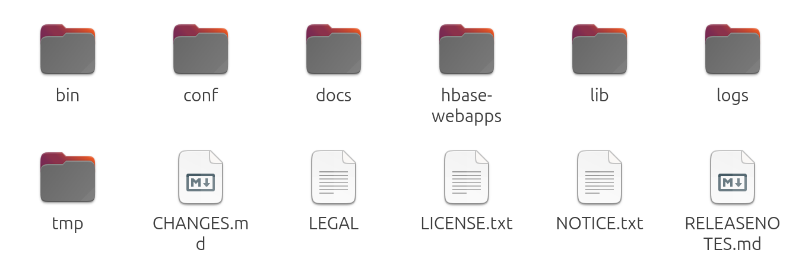
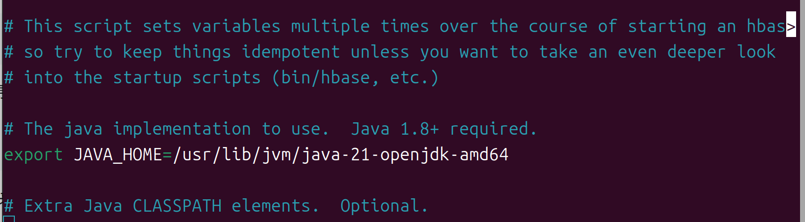

# hbase_learn-base-on-offical-file
依旧伪分布式集群

首先贴上官方文档链接：[hbase快速上手](https://hbase.apache.org/book.html#getting_started)

*首先我需要说一下单机的hbase，用以快速上手。*

*单机的hbase的部署非常简单，不需要思考什么，只需要照搬hadoop的部署方式。下面就来讲讲：*
## 1.下载和解压
首先还是需要下载一个你喜欢的版本，[下载链接在这](https://dlcdn.apache.org/hbase/)（不需要魔法）

笔者这里下载的是2.5.12-bin.tar.gz。根据官方文档，不建议下载后缀带有src的文件包，表示为尚未完全实现。

然后解压，可以使用指令解压，
```
cd 你的下载路径
tar xzvf 你下载的包
```
此时你下载的包就在当前目录下解压好了

或者你可以在可视化界面中进行移动文件并解压（我相信你会）
## 2.环境配置
解压好后，进入到你解压的文件夹中，一直进（也就2层），直到看到如图内容OK，现在在CLI输入
```
nano conf/hbase-env.sh
```
进入之后找到官方注释掉的JAVA路径(在大概第28行的位置)，去掉注释，输入你的JAVA路径（和hadoop一样就行）

改完如图

## 3.单机使用
没错，单机可以开始用了，为了开启hbase，请在CLI输入
```
bin/start-hbase.sh
```
此时，所有HBase守护进程（包括HMaster、HRegionServer和ZooKeeper）都运行在同一个Java虚拟机（JVM）中，并且它会使用本地文件系统来存储所有数据。

至此，单机的部署就可以完成了，你可以通过 http://localhost:16010 网址查看你的hbase运行状态，这是默认端口。至于具体的使用方式，后面会讲。

