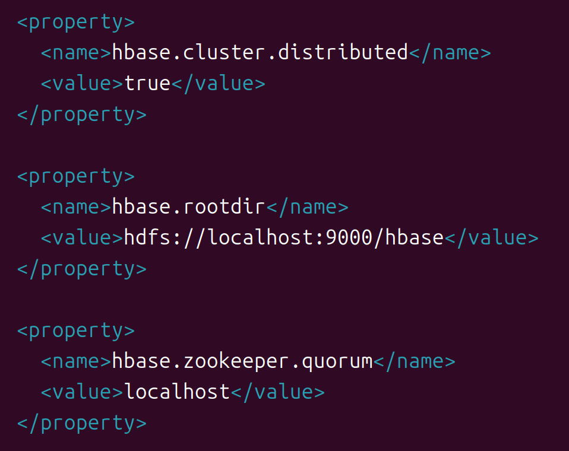

<!--
 * @Author: nineanswerer 787922829@qq.com
 * @Date: 2025-09-22 18:13:37
 * @LastEditors: nineanswerer 787922829@qq.com
 * @LastEditTime: 2025-09-24 20:41:57
 * @FilePath: \hbase_learn-base-on-offical-file\ppt的讲解.md
 * @Description: 这是默认设置,请设置`customMade`, 打开koroFileHeader查看配置 进行设置: https://github.com/OBKoro1/koro1FileHeader/wiki/%E9%85%8D%E7%BD%AE
-->
# 讲解前置内容

## 一.各版本差异及适配问题
首先我们需要知道，hbase在Hadoop生态中必不可少，不论是生产生活还是教育工作，他们的联系都非常紧密。
### 版本命名规则
hbase的版本命名规则通常由三个部分组成（例如 2.4.9。）
* 第一个数字代表主版本号（major version），通常是重大更新，可能会有不兼容的API变更；
* 第二个数字代表次版本号（minor version），通常是新功能或改进，保持向后兼容；
* 第三个数字代表修订版本号（patch version），通常是错误修复或性能优化，一般完全兼容。
主流版本中，Hbase分为1.x ，2.x ，3.x三种系列，如下表：

#### HBase 版本特性对比

| 特性 / 版本 | HBase 1.x 系列 | HBase 2.x 系列 | HBase 3.x 系列 |
|-------------|----------------|----------------|----------------|
| **主要特点** | 成熟稳定，功能相对较旧，适合老项目。 | 主流版本，性能、稳定性、运维和新功能显著提升，如RegionServer写入优化（WAL），更强大的Web UI等。 | 仍在开发中，可能包含更激进的架构变化和新特性。 |
| **Hadoop 兼容性** | 主要兼容旧版 Hadoop 2.x 系列，对新版支持不佳。 | 广泛兼容 Hadoop 3.x，也支持部分 Hadoop 2.x 版本，推荐与新版Hadoop生态配合使用。 | 预计将以最新的 Hadoop 3.x 系列为主要兼容目标，并深度集成最新生态特性。 |
| **推荐用途** | 维护现有老项目，追求稳定可靠。 | 部署新项目，或从旧版本升级，追求更高性能和新功能。 | 关注未来发展，用于测试和研究新特性。不推荐用于生产环境。 |
| **社区支持** | 社区支持力度逐渐减弱，主要以维护为主。 | 活跃的社区支持，功能更新快，文档丰富。 | 社区关注热点，但尚未发布正式版本，文档和支持仍在完善中。 |

通常来讲，社区的主流开发和维护的重心会围绕在当前年限下的最新版本和稳定版本，如现在的3.x系列是最新的，而2.x是稳定版本。
对于我们学习使用，我们选取hbase2.5.12版本作为使用，他的前置hadoop版本建议为3.x，我们这里安装为3.3.6版本号。
如果你想看版本故事，可以点击这里[版本背景和故事](#story)
### 各版本差异
#### HBase 文件类型及用途
<table border="1" style="border-collapse: collapse; width: 100%;">
  <thead>
    <tr>
      <th style="background-color: #f2f2f2; text-align: center;">文件类型</th>
      <th style="background-color: #f2f2f2; text-align: center;">主要用途</th>
      <th style="background-color: #f2f2f2; text-align: center;">适用场景</th>
    </tr>
  </thead>
  <tbody>
    <tr>
      <td style="font-weight: bold;">hbase-x.x.x-bin.tar.gz</td>
      <td>预编译的二进制版本，包含可立即运行的HBase。</td>
      <td>✅ 绝大多数情况，用于直接安装和部署。</td>
    </tr>
    <tr>
      <td style="font-weight: bold;">hbase-x.x.x-src.tar.gz</td>
      <td>源代码版本，包含构建HBase所需的全部源代码。</td>
      <td>🔧 需要查看源码、自定义修改或进行二次开发。</td>
    </tr>
    <tr>
      <td style="font-weight: bold;">hbase-x.x.x-client-bin.tar.gz</td>
      <td>预编译的HBase客户端二进制版本，用于客户端安装。</td>
      <td>🖥️ 仅需要HBase客户端功能时使用。</td>
    </tr>
    <tr>
      <td style="font-weight: bold;">hbase-x.x.x-hadoop3-bin.tar.gz</td>
      <td>预编译的HBase二进制版本，特别为Hadoop 3环境打包。</td>
      <td>🌐 在Hadoop 3环境中部署HBase时使用。</td>
    </tr>
    <tr>
      <td style="font-weight: bold;">hbase-x.x.x-hadoop3-client-bin.tar.gz</td>
      <td>预编译的HBase客户端二进制版本，特别为Hadoop 3环境打包。</td>
      <td>🖥️ 在Hadoop 3环境中仅需要HBase客户端功能时使用。</td>
    </tr>
    <tr>
      <td style="font-weight: bold;">*.asc, *.sha512</td>
      <td>校验文件，用于验证下载文件的完整性和真实性。</td>
      <td>🔒 对安全有严格要求。</td>
    </tr>
  </tbody>
</table>

我们正常学习工作用的都是-bin.tar.gz格式的，只有深入开发研究时候才会选择-src.tar.gz格式的包。

### 版本适配
对于我们来说，重要的是不停版本和Hadoop的适配问题，通常而言：
* HBase 1.x 系列主要与 Hadoop 2.x 和 Java 7/8 配合良好；
* HBase 2.x 系列则需要 Java 8+，并广泛兼容 Hadoop 3.x（同时也支持部分 Hadoop 2.x 版本），是与新版 Hadoop 生态配合的推荐选择；
* HBase3.x目前没找到消息，不过预计是和Hadoop3.x适配。
总之，在使用稳定版的情况下，我们就是使用Java11+，Hadoop3.x是没毛病的。


| HBase 核心版本 | JDK 要求 | Hadoop 兼容性 | ZooKeeper 兼容性 | 可信赖的网址（官方/权威文档） |
|---------------|---------|--------------|-----------------|----------------------------|
| HBase 1.4.x | 1.7/1.8 | 2.6-2.10.x | 3.4-3.5.x | Apache HBase 1.4 Reference Guide (PDF)（可从 Apache 网站下载） |
| HBase 2.4.x | 1.8 | 3.1-3.3.x | 3.5-3.7.x | Apache HBase 2.4 API Docs (官方 API 文档) |
| HBase 2.5.x | 1.8/11 | 3.3.4.x & Hadoop 3.x | 3.7-3.8.x | Apache HBase Downloads Page (获取下载和发行说明) |
| HBase 3.0.0-alpha | 11+ | 3.4.x+ | 3.8.x+ | Apache Mail Archives (HBase 3 Release Plans) (HBase 开发者邮件列表讨论) |


## 二. 通用文件配置设置
在下载解压好的文件夹中，有这样几个核心目录：
| 目录名 | 核心作用 | 包含的文件类型举例 |
| :--- | :--- | :--- |
| **bin/** | 存放可执行脚本 | 启动/停止脚本（`start-hbase.sh`, `stop-hbase.sh`）、HBase Shell客户端（`hbase`）、各种工具脚本（如`hbase-daemon.sh`） |
| **conf/** | 存放配置文件 | 核心配置文件（`hbase-site.xml`）、环境变量配置（`hbase-env.sh`）、注册RegionServer的节点（`regionservers`） |
| **lib/** | 存放依赖的JAR包 | HBase自身及依赖的第三方库（JAR文件），如Hadoop、ZooKeeper、Guava等库 |
| **logs/** | 存放运行时日志 | HMaster日志、RegionServer日志、HBase Shell操作日志等，是排查问题的首要依据 |

而我们在使用时候，修改最多的就是conf文件夹，如下：
HBase 的主要配置文件位于 `conf` 目录中 。这是非常重要的目录，包含了 HBase 的所有配置文件 。

* **`hbase-env.sh`**: 这是一个用于 Linux/Unix 环境的脚本，用于设置 HBase 的工作环境 。您需要在此文件中配置 **`JAVA_HOME`** 的位置以及其他环境变量。如果您不使用自带的 ZooKeeper，则需要将 `HBASE_MANAGES_ZK` 设置为 `false` 。
根据实践，我的文件中有以下代码：


除此之外，次文件再无更改。
* **`hbase-site.xml`**: 这是 HBase 的主配置文件 。此文件指定了用于覆盖 HBase 默认配置的选项。您可以在此文件中配置 `hbase.rootdir` 以指定 HBase 在 HDFS 上的根目录，以及 `hbase.zookeeper.quorum` 来指定 ZooKeeper 集群的主机名。
文件中代码除了注释外的只有：


上面图片中代码为
```
  <property>
    <name>hbase.cluster.distributed</name>
    <value>true</value>
  </property>

  <property>
    <name>hbase.rootdir</name>
    <value>hdfs://localhost:9000/hbase</value>
  </property>

  <property>
    <name>hbase.zookeeper.quorum</name>
    <value>localhost</value>
  </property>

  <property>
      <name>hbase.manages.zk</name>
      <value>true</value>
  </property>

</configuration>

```
* **`regionservers`**: 这是一个纯文本文件，其中包含了应在 HBase 群集中运行 RegionServer 的主机列表。默认情况下，此文件只包含单个条目 `localhost` 。您需要将其修改为对应的主机名或 IP 地址，每行一个
这是全分布式的，我们暂时不用
---


<a id="story">
背景历史：

从最初到1.0版本时代的发展：[取自博客园文章](https://www.cnblogs.com/a198720/articles/4648567.html)
HBase2.0版本在2018年以前已经存在了，由于一些因素，造成无人管理。于是又经一年多的时间才将稳定版本发布出来。
到2.0的大体时间表：[博客园文章](https://www.cnblogs.com/quchunhui/articles/9797325.html)
根据官网版本分析，2.4.18 ，2.5.12 ，2.6.3这几个版本目前是稳定版本。
至于3.x系列目前还在开发阶段，这一点我们通过官网或者镜像瞎子啊界面也可以看出来，3.0.0-beta-1版本是唯一的3.x系列测试版。

</a>