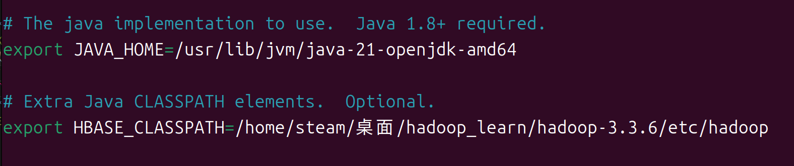
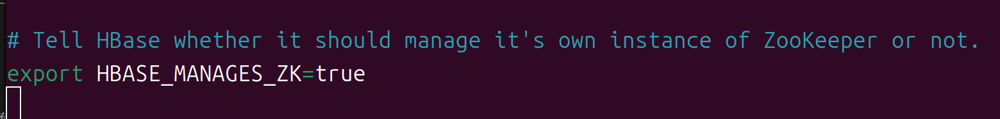
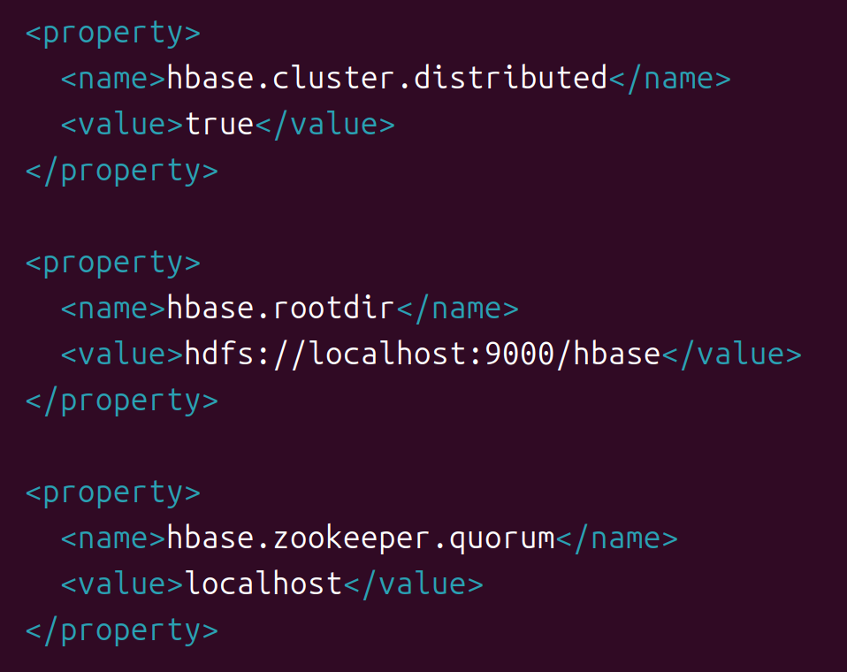
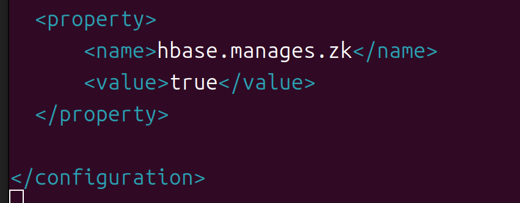

<<<<<<< HEAD
## HBase 伪分布式安装报告

---

### 1. 前置条件 (基本需求)

在进行 HBase 伪分布式安装之前，需要满足以下基本要求：

* **操作系统**: 推荐使用 **Linux** 系统，官方不建议在 Windows 机器上运行生产系统。
* **Hadoop**: 推荐使用兼容版本的 Hadoop 。从 HBase 2.5.2 开始，HBase 提供了使用 Hadoop 2.x 和 Hadoop 3.x 构建的二进制版本 。从 HBase 3.0 开始，HBase 提供了两个二进制包：一个**经典包**，包含 HBase 和 Hadoop 组件；另一个是**无 Hadoop 的包**（"自带 Hadoop" package），省略了 Hadoop 组件，并使用现有的 Hadoop 安装 。如果您的集群节点已安装 Hadoop，则可以使用无 Hadoop 包。
* **Java**: HBase 在 Java 虚拟机上运行。请确保安装了与您所使用的 HBase 版本兼容的 JDK。
* **ZooKeeper**: 在单机或伪分布式模式下，您可以选择使用 HBase 自带的 ZooKeeper。需要注意的是，自带的 ZooKeeper 仅用于管理 HBase，适合学习使用 。

---

### 2. 配置与修改文件

HBase 的主要配置文件位于 `conf` 目录中 。这是非常重要的目录，包含了 HBase 的所有配置文件 。

* **`hbase-env.sh`**: 这是一个用于 Linux/Unix 环境的脚本，用于设置 HBase 的工作环境 。您需要在此文件中配置 **`JAVA_HOME`** 的位置以及其他环境变量。如果您不使用自带的 ZooKeeper，则需要将 `HBASE_MANAGES_ZK` 设置为 `false` 。
根据实践，我的文件中有以下代码：
* **`hbase-site.xml`**: 这是 HBase 的主配置文件 。此文件指定了用于覆盖 HBase 默认配置的选项。您可以在此文件中配置 `hbase.rootdir` 以指定 HBase 在 HDFS 上的根目录，以及 `hbase.zookeeper.quorum` 来指定 ZooKeeper 集群的主机名。
* **`regionservers`**: 这是一个纯文本文件，其中包含了应在 HBase 群集中运行 RegionServer 的主机列表。默认情况下，此文件只包含单个条目 `localhost` 。您需要将其修改为对应的主机名或 IP 地址，每行一个。

---

### 3. 启动与进程查看

在启动 HBase 之前，请确保 Hadoop 和 ZooKeeper 服务已经启动。

HBase 有两种启动方式：

* **启动方式 1 (逐个启动)**:
    * 启动 Master：`bin/hbase-daemon.sh start master` 
    * 启动 RegionServer：`bin/hbase-daemon.sh start regionserver` 
    * 停止服务时，只需将 `start` 替换为 `stop` 即可。
* **启动方式 2 (一键启动)**:
    * 运行 `bin/start-hbase.sh` 脚本。

---

### 4. 判断正常运行

您可以通过多种方式查看 HBase 是否正常运行：

* **命令行**: 使用 `jps` 命令查看 Java 进程。如果 HBase 启动成功，您应该能看到 `HMaster` 和 `HRegionServer` 进程。
* **Web UI**: HBase Master 的 Web UI 默认运行在 **16010** 端口。您可以通过浏览器访问它来查看集群状态。
=======
## HBase 伪分布式安装报告

---

### 1. 前置条件 (基本需求)

在进行 HBase 伪分布式安装之前，需要满足以下基本要求：

* **操作系统**: 推荐使用 **Linux** 系统，官方不建议在 Windows 机器上运行生产系统。
* **Hadoop**: 推荐使用兼容版本的 Hadoop 。从 HBase 2.5.2 开始，HBase 提供了使用 Hadoop 2.x 和 Hadoop 3.x 构建的二进制版本 。从 HBase 3.0 开始，HBase 提供了两个二进制包：一个**经典包**，包含 HBase 和 Hadoop 组件；另一个是**无 Hadoop 的包**（"自带 Hadoop" package），省略了 Hadoop 组件，并使用现有的 Hadoop 安装 。如果您的集群节点已安装 Hadoop，则可以使用无 Hadoop 包。
* **Java**: HBase 在 Java 虚拟机上运行。请确保安装了与您所使用的 HBase 版本兼容的 JDK。
* **ZooKeeper**: 在单机或伪分布式模式下，您可以选择使用 HBase 自带的 ZooKeeper。需要注意的是，自带的 ZooKeeper 仅用于管理 HBase，适合学习使用 。

---

### 2. 配置与修改文件

HBase 的主要配置文件位于 `conf` 目录中 。这是非常重要的目录，包含了 HBase 的所有配置文件 。

* **`hbase-env.sh`**: 这是一个用于 Linux/Unix 环境的脚本，用于设置 HBase 的工作环境 。您需要在此文件中配置 **`JAVA_HOME`** 的位置以及其他环境变量。如果您不使用自带的 ZooKeeper，则需要将 `HBASE_MANAGES_ZK` 设置为 `false` 。
根据实践，我的文件中有以下代码：


除此之外，次文件再无更改。
* **`hbase-site.xml`**: 这是 HBase 的主配置文件 。此文件指定了用于覆盖 HBase 默认配置的选项。您可以在此文件中配置 `hbase.rootdir` 以指定 HBase 在 HDFS 上的根目录，以及 `hbase.zookeeper.quorum` 来指定 ZooKeeper 集群的主机名。
文件中代码除了注释外的只有：



上面图片中代码为
```
  <property>
    <name>hbase.cluster.distributed</name>
    <value>true</value>
  </property>

  <property>
    <name>hbase.rootdir</name>
    <value>hdfs://localhost:9000/hbase</value>
  </property>

  <property>
    <name>hbase.zookeeper.quorum</name>
    <value>localhost</value>
  </property>

  <property>
      <name>hbase.manages.zk</name>
      <value>true</value>
  </property>

</configuration>

```
* **`regionservers`**: 这是一个纯文本文件，其中包含了应在 HBase 群集中运行 RegionServer 的主机列表。默认情况下，此文件只包含单个条目 `localhost` 。您需要将其修改为对应的主机名或 IP 地址，每行一个
这是全分布式的，我们暂时不用
---

### 3. 启动与进程查看

在启动 HBase 之前，请确保 Hadoop 和 ZooKeeper 服务已经启动。

HBase 有两种启动方式：

* **启动方式 1 (逐个启动)**:
    * 运行 `./bin/start-hbase.sh` 脚本。

---

### 4. 判断正常运行

您可以通过多种方式查看 HBase 是否正常运行：

* **命令行**: 使用 `jps` 命令查看 Java 进程。如果 HBase 启动成功，您应该能看到 `HMaster` 和 `HRegionServer` 进程。
* **Web UI**: HBase Master 的 Web UI 默认运行在 **16010** 端口。您可以通过浏览器访问它来查看集群状态。
>>>>>>> 57b90469e55b268cf1f6656595916d0204cec8df
* **日志文件**: `logs` 目录是排查问题时最关键的目录之一 。HBase 的所有服务（如 Master、RegionServer 等）都会将日志输出到此目录。